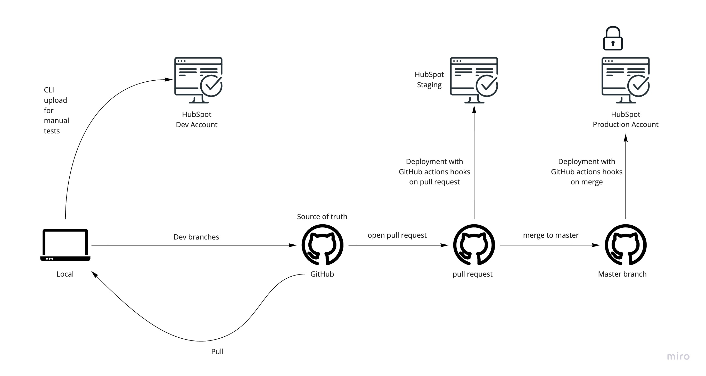

# [Codurance Hubspot account](https://app.hubspot.com/getting-started/3042464/v3)

LeanKit board ( Service Line Transformation ): [board](https://codurance-online.leankit.com/board/1048837936)
  

## Setup the development environment

Prerequisites :
1. Have a [developer sandbox](#developer-sandbox)
2. npm

after cloning this repository

- Install dependencies and Hubspot CLI :
`npm install`

- Connect your local environment to your [developer sandbox](#developer-sandbox) :
1. `npx hs init`
2. On the prompt press enter, it opens a browser new page
3. In the page, choose your developer sandbox account and click on **Continue with this account**
4. copy the personal access key and paste it in your terminal
5. enter a name that references your sandbox account : this name will be only visible by you
6. check the file hubspot.config.yml has been created

- Upload Hubspot code to your developer sandbox
`npx hs upload version_control version_control`

For more information some links to the hubspot official documentation:
[getting started with local development](https://developers.hubspot.com/docs/cms/guides/getting-started-with-local-development)
[hubspot CLI reference](https://developers.hubspot.com/docs/cms/developer-reference/local-development-cms-cli).

Hubspot code is within the version_control folder.
  

## Development workflow

  

## 🏗 File Structure

In order to make use of some global styles and utilities that use `HUBL`, we need to structure our codebase differently than the Hubspot default.
  

### 🗂 css

You will notice some css files are prefixed with an underscore (`_colors.css`). These files are partial css files, which means they are not loaded themselved into pages or modules. They are instead imported into another file.

Files that are not prefixed with an underscore, are files that will be loaded in by modules or pages.
  

#### **|– 📁 base**

This folder contains all of styles for the base, and global styling of our website. This is where we set up our variables and styles for colours, layout, typography, buttons etc.
  

#### **|– 📁 modules**

Traditionally, modules within Hubspot are created as folders that contain their own `js`, `css` and `html` files, as well as some additional `json` files for meta data and data regarding input fields for the Hubspot UI. Since `HUBL` does not work within the `css` files of modules, we have to take a different approach to where we locate the styles.

To be able to use `HUBL` within our module's styles, we create a stylesheet with the same name as the module here. We then link to that file by using `{{ require_css(get_asset_url("relative-path-to-css")) }}` at the top of our module's `htmlz file.

Only the styles that are relevant to the internals of the module will be placed in the modules.css file. Any styling relating to the layout of the module on the page should be done through the page's stylesheet. This allows us to encapsulate styles to modules and pages.
  

#### **|– 📁 pages**

When a page or template is created, a stylesheet for it is created with the same name as the page here. The styles relating to laying out modules within the page are kept here. Any styling relating to the internals of a module should be within the module's stylesheet.

The page or template can load these specfifc style's in the head of the `html` using `{{ require_css(get_asset_url("relative-path-to-css")) }}`.
  

#### **|– 📁 partials**

Any styles relating to a partial within the `./Codurance_September2020/templates/partials` folder will be kept here. Similar to modules, we create a stylesheet with the same name as the partial and then link to the stylesheet from the partial's `html` using `{{ require_css(get_asset_url("relative-path-to-css")) }}`.
  

#### **|– 📁 utils**

This folder contains partial utility files, which get combined into a single stylesheet called `utils.css`. This stylesheet can get imported into others to be able to access utility macros for development.

[More information on Macros and how to use them](https://developers.hubspot.com/docs/cms/hubl/variables-macros-syntax).
  

### 🗂 fonts

All fonts are linked to through the head of the `base.html` file. This includes the Proxima Nova font, and the LineAwesome icon library. This will be enough moving forward to complete pages.

As we develop on the site we want to look at cutting out everything that is no longer being used.
  

### 🗂 images

This folder ws created post migration by Hubspot to hold certain images used within the website.

As we use more images in the site, we can upload them to a relevent folder within Hubspot and link to them within our code. This provides us with then benefit of not having to store them within our Theme and in our version control system. It also allows the image to be served through the CDN that Hubspot uses - automatically compressing and serving a better optimised image.

As images are not used anymore, we can look to tidy up this folder.
  

### 🗂 js

Here we keep all the `js` files that we create or use for the website, with teh exception of the javascript specific to modules. A module's `js` can be located within the module's `module.js` file.

If you need to write a script that will be present in multiple modules, pages or templates, then it is to be located here.
  

### 🗂 modules

[Information about modules](https://developers.hubspot.com/docs/cms/building-blocks/modules).

This folder contains all the modules used within the site.

To create a module, you can use the following command `hs create module <name> [dest]` or create one using the UI within the Design Tools of Hubspot and pull the module down to your local codebase.
  

### 🗂 snippets

This folder holds `html` snippets which help keep content aligned to the design system, and make it easier for developers to work with.
  

### 🗂 templates

This folder holds the template `html` files for web pages.

[More information on templates](https://developers.hubspot.com/docs/cms/building-blocks/templates).
  

#### **|– 📁 layouts**

Layouts are to be extended by templates. A layout will template out things like the meta information within `<head>` tags, and baisc page structure. The content of a page template will be inserted where the `` tag is featured.
  

#### **|– 📁 partials**

The partials folder holds `html` files that isolate or capture re-usable sections within templates or layouts. An example of these would be a header or a footer.
  

#### **|– 📁 system**

These files are templates for a specific purpose within the site, such as 404 pages. They are set through the settings within Hubspot. More information can be found [here](https://developers.hubspot.com/docs/cms/building-blocks/templates) under `System Pages`.
  

### 🧪 Testing

When you want to test a change made to any hubspot code you have to upload it to your developer sandbox using Hubspot CLI:

`hs upload version_control/Codurance_September2020 Codurance_September2020`

or if would like to watch for changes and re-upload automatically:

`hs watch --portal=<portal name> version_control/Codurance_September2020 Codurance_September2020 --initial-upload --remove`

The script should run on your sandbox portal by default, but to be sure you can include the name you gave your sandbox portal after `--portal=`. You can find your sandbox portal name by looking at the `hubspot.config.yml` file.

You can see your changes if you connect to your sandbox : https://app.hubspot.com/portal-recommend by previewing or creating
a page using the template you modified. The hubspot code is visible in Marketing -> Files and Templates -> Design Tool

***⚠️ For now we cannot propagate a file deletion from local to Hubspot account, so any deleted file has to be deleted also from the Design Tools***
  

### 🧑‍🚀 Staging

Code is automatically deployed in the staging account when a pull request to master is opened

[link of staging account](https://app.hubspot.com/dashboard-library/8691204)
  

### 🚀 Going Live

Once pull request is accepted pushing to master triggers a git action that uploads changes to the [hubspot production account](https://app.hubspot.com/getting-started/3042464/v3) and makes the changes live.
  

## 👩‍💻 Developer Sandbox

1. Go to the [sandbox creation page](https://app.hubspot.com/signup/standalone-cms-developer)
2. Sign in with your Google account
3. Click on 'Create a new developer account'

